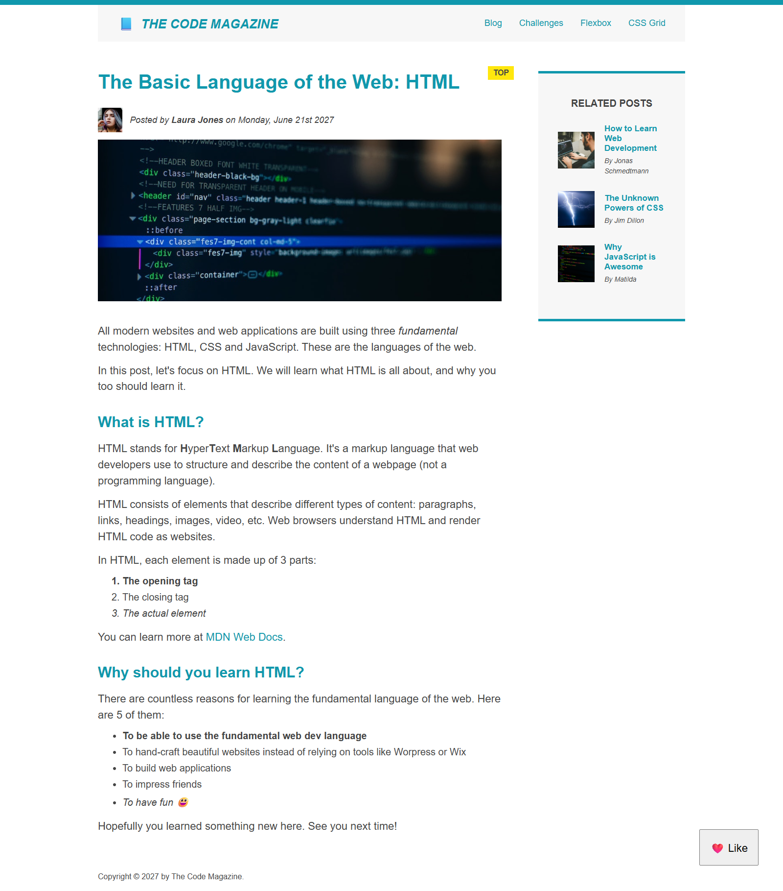

# Responsive Code Magazine Blog 📰

This is a responsive blog post layout inspired by modern magazine websites. It was built using HTML5 and CSS3, with a focus on:

- Semantic HTML structure
- Responsive design principles
- CSS Flexbox and Grid layout techniques

## 🔍 Features

- Clean and readable article format
- Sticky navigation bar
- Highlighted related posts section
- Fully responsive across devices (mobile, tablet, desktop)
- Modern layout using CSS Grid and Flexbox

## 📸 Preview




## 📁 Tech Stack

- HTML5
- CSS3 (Flexbox + Grid)
- No frameworks or libraries

## 🚀 Getting Started

1. Clone the repo:

```bash
git clone https://github.com/nandshiv/minimal-blog-css-grid-flexbox-layout.git
